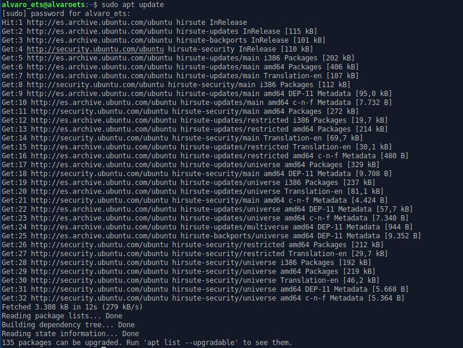
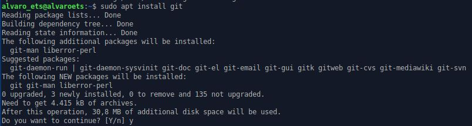
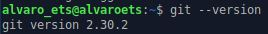
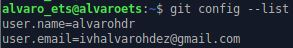

# Instalación de Git en Linux
## Instalacion de Git

Es posible que Git esté instalado ya en el sistema. Para comprobarlo ejecutaremos el siguiente comando:

Vemos que en nuestro caso no está instalado así que vamos a proceder a la instalación. Lo primero será actualizar los repositorios:

Ahora podemos instalar Git:

Y comprobamos que se haya instalado:

## Configuración de  Git
  
El primer paso de la configuración de Git es proporcionar nuestro nombre y correo.

Podemos ver los elementos de configuración con el comando `git config –list`.

Estos elementos de configuración se almacenan en el archivo ~/.gitconfig.

Vemos que el contenido serán los datos que hemos añadido anteriormente.

