# Manipulación avanzada de Repositorios

Vamos a clonar el repositorio remoto https://github.com/jpexposito/libro a nuestro repositorio local.

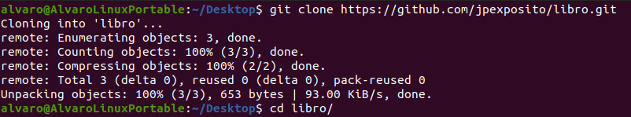

## Ejercicio 1.

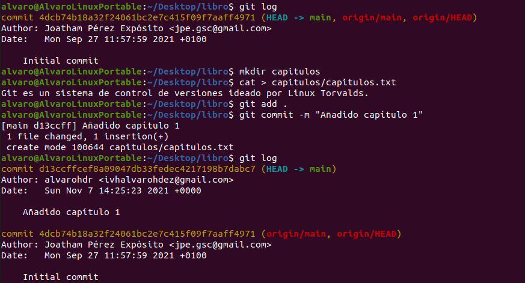

## Ejercicio 2.

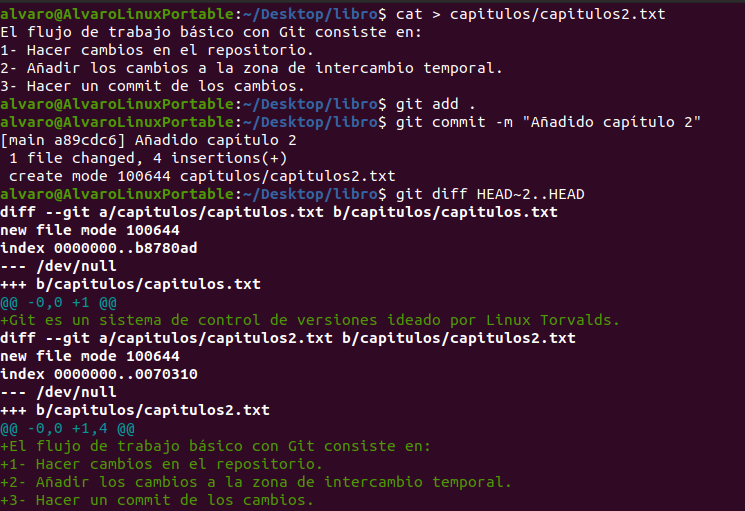

## Ejercicio 3.

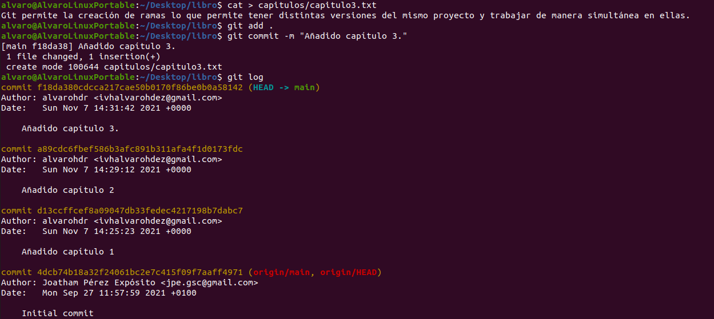

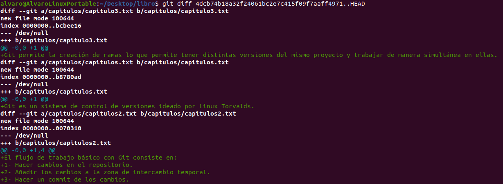

## Ejercicio 4

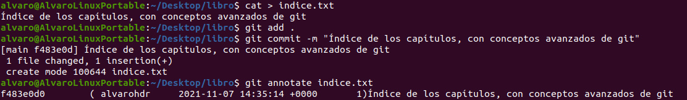

## Ejercicio 5.

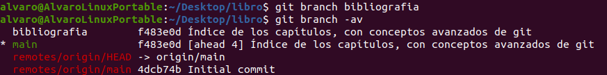

## Ejercicio 6.

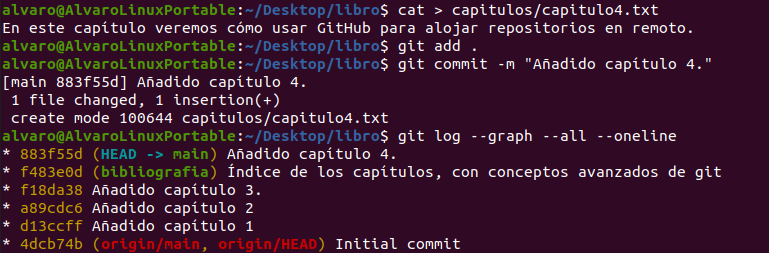

## Ejercicio 7.

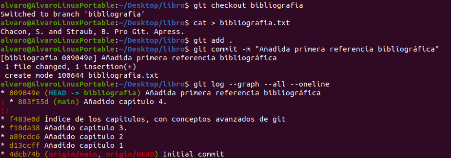

## Ejercicio 8.

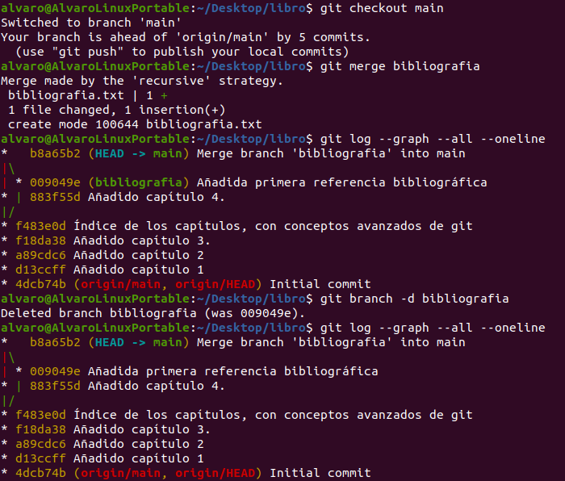

## Ejercicio 9.

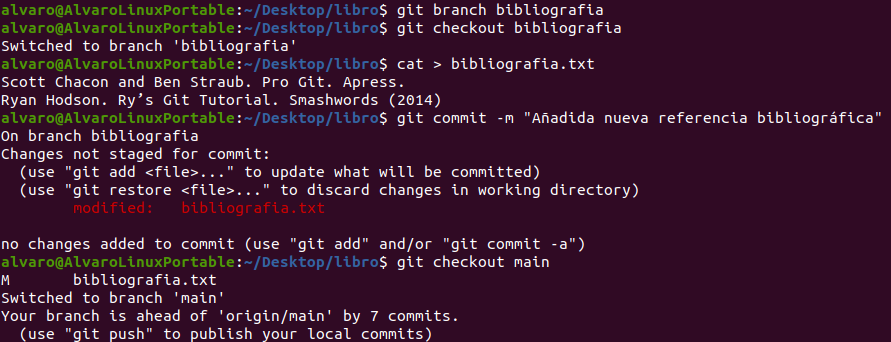

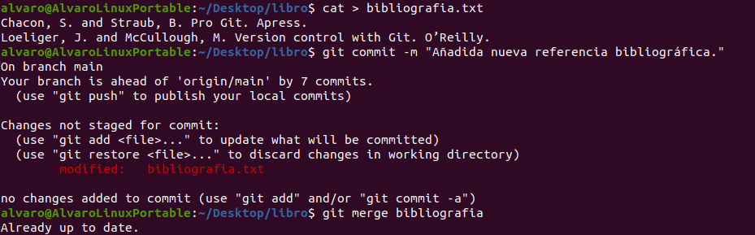

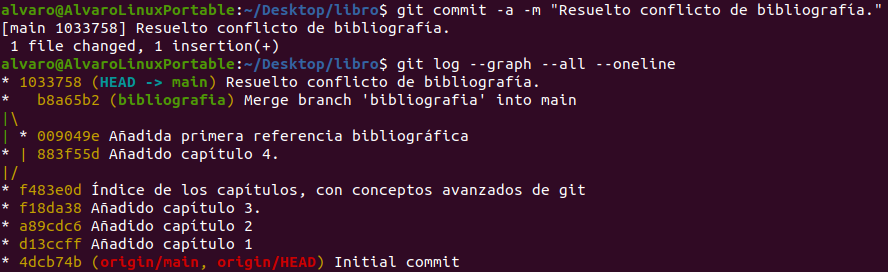
