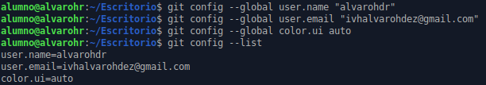
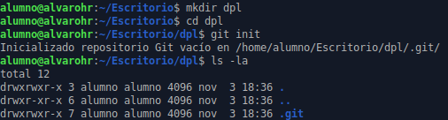
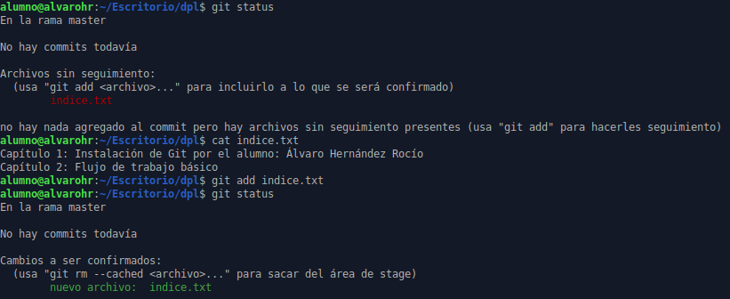
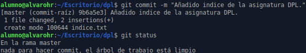
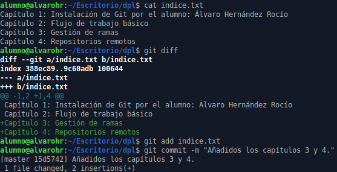

# Manipulación de repositorios en Git
## Configuración

Vamos a definir nuestro nombre, correo y activar el coloreado en la salida.

## Creación de un repositorio

Vamos a crear un repositorio. Para ello creamos un directorio local en nuestro sistema, accedemos a este y ejecutamos el comando “git init” para iniciarlo.

## Comprobar el estado del repositorio

- Comprobamos el estado del repositorio.
- Creamos un fichero al que le ingresamos algún contenido.
- Añadimos el archivo a la zona de intercambio temporal.
- En el estado actual del repositorio nos aparecerá como cambios confirmados la creación del archivo.

## Realizando Commits

- Hacemos un commit.
- Comprobamos el estado del repositorio y vemos que está limpio.

## Modificando ficheros

- Vamos a modificar el fichero “indice.txt”.
- Con “git diff” vemos las diferencias con la última versión guardada.
- Añadimos el archivo y hacemos un commit con un mensaje descriptivo.

## Historial

- Con “git show” mostramos los cambios de la última versión con respecto a la anterior.
- Cambiamos el mensaje del commit anterior.
- Vemos que aparece que el mensaje es diferente.

